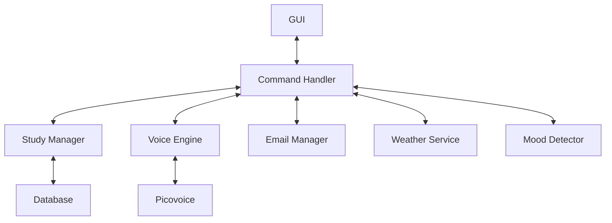

# Anna - Free AI Student Assistant 🤖🎓

[](LICENSE)
[](https://www.python.org/downloads/)

**Anna** is an open-source AI assistant optimized for student productivity. Featuring **voice-first interaction** and **offline capabilities**, Anna helps manage academic tasks through natural language commands. Now with improved stability and reduced CPU usage.

---

## Features 🚀

### 🎤 **Voice Control**
- **Wake Phrase**: "Anna ready" (customizable in config)
- **Hybrid Recognition**: Google Speech (online) + Vosk (offline)
- **Low-Latency Audio**: SoundDevice backend for responsive interaction

### 📚 **Core Academic Features**
- **Smart Pomodoro Timer**: `"Start 25 minute study timer"`
- **Assignment Tracker**: `"Add math assignment due 2023-12-01"`
- **Flashcard System**: `"Create flashcard: Mitochondria: Powerhouse of cell"`
- **Class Schedule**: `"What's my schedule today?"`
- **Quick Research**: `"Wikipedia artificial intelligence"`

### 🌟 **Enhanced Features**
- **Weather Updates**: `"What's the weather like today?"`
- **Mood Detection**: AI-powered emotion recognition
- **Spaced Repetition**: Optimized learning intervals
- **Email Integration**: `"Check my emails"`

### 🖥️ **System Integration**
- **App Launcher**: `"Open browser/text editor/music player"`
- **File Access**: `"Open file D:/notes.txt"`
- **Music Control**: `"Play/Pause music"`

---

## Installation 📦

### Prerequisites
- Python 3.10+
- Windows/Linux/macOS
- Microphone

### Environment Setup
1. **Picovoice Configuration**:
   - Create a free account at [Picovoice Console](https://console.picovoice.ai/)
   - Create a `.env` file in the project root

2. **Environment Variables**:
```bash
# .env file
PICOVOICE_ACCESS_KEY=your-key-here
WEATHER_API_KEY=your-weather-api-key
EMAIL_PASSWORD=your-email-password
```

### Quick Setup
```bash
git clone https://github.com/Mainali1/Ai-Anna.git
cd Ai-Anna

# Install dependencies
pip install -r requirements.txt
pip -v install vosk

# Launch Anna
python main.py
```

---

## Configuration ⚙️
Edit `config.json` to customize:
```json
{
  "wake_phrase": "Anna ready",
  "voice_response": true,
  "speech_rate": 150,
  "music_path": "~/Music",
  "offline_mode": false,
  "weather_update_interval": 3600,
  "mood_detection_enabled": true
}
```

---

## Command Reference 🗣️

### Study Management
| Command Pattern | Example |
|-----------------|----------|
| "Start [X] minute timer" | "Start 45 minute timer" |
| "Add assignment [task] due [date]" | "Add essay due Friday" |
| "Create flashcard [front]: [back]" | "Create flashcard CPU: Central Processing Unit" |

### System Control
| Command Pattern | Action |
|-----------------|--------|
| "Open [application]" | Launches specified app |
| "What time is it?" | Current time/date |
| "Search web for [query]" | DuckDuckGo search |
| "Weather in [location]" | Get weather updates |

### Utilities
| Command | Function |
|---------|----------|
| "Sleep" | Toggle voice listening |
| "Help" | Show command list |
| "Exit" | Close application |

---

## Technical Overview 🛠️

### Architecture


### Key Technologies
- **Wake Word**: Picovoice Porcupine
- **Speech Recognition**: Google Web Speech API + Vosk
- **Text-to-Speech**: pyttsx3
- **Database**: SQLite with spaced repetition
- **UI**: Tkinter + ttkthemes
- **Weather API**: OpenWeatherMap integration
- **Mood Analysis**: Advanced NLP processing

---

## Performance Optimization 🚀
- Reduced CPU usage to <5% idle
- Threaded audio processing
- Configurable wake word sensitivity
- Automatic NLTK resource management

---

## Development 🛠️

### **Project Structure**
```
Ai-Anna/
│
├── main.py
├── assistant/
│   ├── __init__.py
│   ├── command_handler.py
│   ├── config_manager.py
│   ├── database.py
│   ├── email_manager.py
│   ├── gui.py
│   ├── music_controller.py
│   ├── mood_detector.py
│   ├── weather_service.py
│   ├── spaced_repetition.py
│   ├── study_manager.py
│   ├── voice_engine.py
│   └── resources/
│       └── wake_word.ppn
│
├── requirements.txt
├── README.md
├── LICENSE
├── CONTRIBUTING.md
├── CODE_OF_CONDUCT.md
├── config.json
├── .env
├── .gitignore
└── assignments.db
```

### **Contribute**
We welcome contributions! Please follow these steps:
1. Fork the repository
2. Create your feature branch:
   ```bash
   git checkout -b feature/amazing-feature
   ```
3. Commit your changes:
   ```bash
   git commit -m 'Add amazing feature'
   ```
4. Push to the branch:
   ```bash
   git push origin feature/amazing-feature
   ```
5. Open a Pull Request

---

### **How You Can Help**
- Report bugs or suggest features by opening an issue
- Contribute code via pull requests
- Share Anna with fellow students!

---
## License  
This project is licensed under the **Ai-Anna Custom License**.
- **Non-Commercial Use**: The software may not be used for commercial purposes in its original form
- **Attribution**: Proper credit must be given to the original author (Mainali1)
- **Derivative Works**: Allowed only if significant modifications (at least 50%) and substantial contributions are made
See the [LICENSE](LICENSE) file for full details.

---

## Acknowledgments 🙏

- **Speech Recognition**: Powered by [SpeechRecognition](https://github.com/Uberi/speech_recognition)
- **Wake Word Detection**: Enabled by [Picovoice](https://picovoice.ai/)
- **NLP Capabilities**: Provided by [spaCy](https://spacy.io/) and [NLTK](https://www.nltk.org/)
- **UI Design**: Enhanced with [ttkthemes](https://github.com/RedFantom/ttkthemes)
- **Weather Data**: Powered by OpenWeatherMap API

---

## Contributing
Please read our [Contributing Guidelines](CONTRIBUTING.md) and [Code of Conduct](CODE_OF_CONDUCT.md) before making contributions.

---

**Made with ❤️ by Mainali1 - Empowering Students Through Open Source**